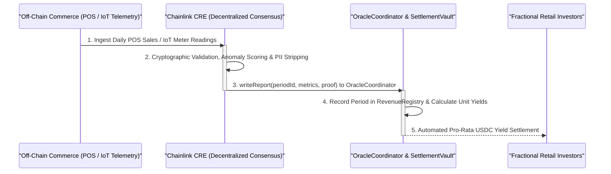

<div align="center">

# Rubh (ربح)

**Institutional-Grade Sharia-Compliant Real-World Asset (RWA) Marketplace Powered by Chainlink CRE**

[](https://chain.link/chainlink-runtime-environment)
[](https://rubh.com)
[](https://opensource.org/licenses/MIT)

_Democratizing GCC SME Trade & Asset Financing from $10 with Tamper-Proof Cryptographic Verification._

</div>

---

## 1. Vision & Executive Summary

**Rubh (ربح)** turns physical, fast-moving SME inventory and revenue-generating business assets in Saudi Arabia and the GCC into fractional, yield-bearing digital assets. 

By replacing self-reported financial statements with **Chainlink CRE (Chainlink Run Environment)** tamper-proof verification — pulled directly from point-of-sale systems, ERPs, and industrial IoT devices — investors can see exact business performance in real time rather than relying on static financial statements. 

Rubh provides SMEs with a choice of **Sharia-compliant financing structures** matched to their actual capital needs, while offering global retail investors fractional, asset-backed opportunities starting from just **$10 (~37.5 SAR)**. Beyond the initial financing product, Rubh's long-term roadmap evolves into a full commercial neobank with multiple revenue streams built upon the same verified-performance infrastructure.

---

## 2. The Structural Problem

- **For Businesses:** SMEs in Saudi Arabia and the broader GCC face a structural financing deficit exceeding **SAR 250 billion**. Traditional banks reject a large share of micro-SME loan applications due to a lack of multi-year audited financial histories and collateral requirements that small operators cannot meet.
- **For Investors:** Retail capital is trapped in low-yield savings accounts or locked out of high-yield private markets by steep minimum investment thresholds (often SAR 10,000 to $100K+).
- **For Existing Platforms (The "Oracle Problem"):** Current debt-crowdfunding competitors (e.g. Lendo, Funding Souq, Manafa) suffer from a fundamental "Oracle Problem" — they rely on self-reported financial statements, static PDFs, and manual auditing, giving investors no independent way to verify that underlying commercial activity is real and ongoing.

---

## 3. The Solution — SME-Driven, Dual-Structure Financing

Rather than forcing every business into a single instrument, each SME chooses the Sharia-compliant structure that fits its actual need — short-cycle trade finance or longer-cycle growth capital — and sets its own deal terms. Rubh does not impose fixed terms; the business offers terms attractive enough to draw investor capital, and investors decide, deal by deal, whether to participate from a **$10 minimum ticket**.

```
                           ┌─────────────────────────────────────────┐
                           │               Rubh (ربح)                │
                           │   Sharia-Compliant RWA Marketplace      │
                           └────────────────────┬────────────────────┘
                                                │
                     ┌──────────────────────────┴──────────────────────────┐
                     ▼                                                     ▼
        ┌─────────────────────────┐                           ┌─────────────────────────┐
        │  Model A: Murabaha      │                           │  Model B: Musharakah    │
        │  (مرابحة - Cost-Plus)   │                           │  (مشاركة - Profit-Share)│
        ├─────────────────────────┤                           ├─────────────────────────┤
        │ • Inventory Trade       │                           │ • Capital Asset Equity  │
        │ • Fixed Pre-Agreed Rate │                           │ • Proportional P&L Share│
        │ • Enforceable Buyback   │                           │ • Upside & Downside Move│
        │ • POS (Square/Foodics)  │                           │ • IoT Telemetry / Meters│
        └─────────────────────────┘                           └─────────────────────────┘
```

### Financing Model A — Murabaha (Cost-Plus Trade Finance)
A dedicated independent Special Purpose Vehicle (SPV) takes constructive ownership of a defined batch of inventory on behalf of investors, then resells it to the SME at a fixed, pre-agreed markup. 
- **Repayment:** Daily POS sell-through, weekly, monthly, or term-end lump sum up to 12 months.
- **Verification:** Chainlink CRE verifies sell-through directly from the merchant's POS system (Square, Foodics, ERP), triggering automated investor repayments.
- **Capital Protection:** If inventory remains unsold beyond the agreed term, a legally enforced buyback clause requires the SME to repurchase the remainder at cost, protecting investor principal.
- **Case Example:** *Al-Nakhla Luxury Retail Seasonal Restock (Jeddah)* — 12.0% fixed markup, 6-month term, continuous Square POS sell-through.

### Financing Model B — Musharakah (Equity / Profit-Share Partnership)
Investors take fractional, proportional ownership in a specific revenue-generating asset or business unit — not the SME's enterprise as a whole — and share in verified profit or revenue generated by that asset over time.
- **Mechanism:** True profit-and-loss-sharing structure. Returns track actual performance, sharing both upside and downside without fixed markups or buyback guarantees.
- **Verification:** Operational IoT metering and telemetry connected on-chain via Chainlink CRE.
- **Case Example:** *Tawrea Water-as-a-Service (WaaS) Station (Dammam 2nd Industrial City)* — Build-Own-Operate facility treating wastewater under a 10-year offtake contract. IoT flow meters and pressure sensors stream directly into Chainlink CRE (18.2% target profit-share).

---

## 4. Core Competitive Moats

1. **The CRE Data Moat:** Competitors validate static deeds or audited PDFs. Rubh validates dynamic, real-time commercial and operational data — POS sell-through for Murabaha, IoT telemetry output for Musharakah — through tamper-proof, on-chain data pipelines that create a high technical barrier to entry.
2. **Micro-Capital Accessibility:** A **$10 minimum ticket size (~37.5 SAR)** unlocks the mass-market retail demographic, heavily undercutting conventional crowdfunding minimums of $250 to $100,000+.
3. **Dual-Structure Flexibility:** Matches instrument to need. Musharakah is genuine profit/loss sharing for capital assets. Murabaha is a fixed-fee, non-compounding trade finance structure avoiding compounding-interest traps.

---

## 5. Technical Architecture & Chainlink CRE Workflows

Rubh uses **Chainlink CRE (Chainlink Run Environment)** to cryptographically connect off-chain commerce to on-chain smart contracts.



### CRE Workflows in this Repository:
- `oracle-CRE-Integrations/square-workflow/`: Daily POS sales fetching, category aggregation, on-chain tokenized category filtering, and signed report submission.
- `oracle-CRE-Integrations/kyc-settlement-workflow/`: Zero-PII on-chain investor compliance whitelist settlement.
- `oracle-CRE-Integrations/compliance-export-workflow/`: Real-time immutable audit trails for regulatory sandbox reporting.

---

## 6. Legal, SPV & Regulatory Sandbox Structure

- **Regulatory Sandbox Entry (KSA):** Applying for an Experimental Permit under the **Saudi Capital Market Authority (CMA) FinTech Lab** and **Saudi Central Bank (SAMA) Sandbox** to onboard capped SME and retail investor pilot cohorts.
- **Independent Orphan SPV:** Financed batches are held by orphan Special Purpose Vehicles (SPVs) independently held from Rubh, with Rubh acting as Manager/Servicer to preserve **Arranger status** while securing investor constructive ownership.
- **Global Investor Access:** Evaluated under offshore / UAE regulatory frameworks (DIFC DFSA Tokenisation Cohort or ADGM FSRA) to onboard international retail capital.

---

## 7. Long-Term Vision — Beyond Financing (The Verified Neobank)

Rubh's financing marketplace is the entry point, not the end state. The same verified-performance infrastructure — on-chain data pipelines, KYC/compliance rails, and USDC settlement — is intended to support a broader **commercial neobank** over time, providing:
1. Automated SME Working Capital & Treasury Management.
2. Verified Performance Invoicing & Real-Time Trade Settlement.
3. Institutional-Grade Private Market Secondary Liquidity.

---

## 8. Repository Structure

```
Rubh/
├── docs/                             # Vision, product specifications & legal memos
│   └── Rubh (ربح).md
├── frontend/                         # Next.js 15 web application (TailwindCSS, Thirdweb v5, Viem)
│   ├── src/app/(marketing)/          # Rubh landing page & dual-structure explorer
│   ├── src/app/(app)/investor/       # Marketplace, deal details & portfolio
│   ├── src/app/(app)/merchant/       # SME issuance & settlement funding
│   ├── src/app/(app)/compliance/     # CMA/SAMA Sandbox control & audit export
│   └── src/components/branding/      # Rubh Arabic & English SVG logo components
├── smart-contracts/                  # EVM contracts (Foundry)
│   ├── src/core/ProductBatchFactory.sol
│   ├── src/core/OracleCoordinator.sol
│   ├── src/core/RevenueRegistry.sol
│   └── src/core/SettlementVault.sol
├── oracle-CRE-Integrations/          # Chainlink CRE Workflows
│   ├── square-workflow/              # POS sell-through verification
│   ├── kyc-settlement-workflow/      # Zero-PII compliance attestation
│   └── compliance-export-workflow/   # Regulatory audit export
└── backend/                          # Fastify API gateway & metadata store
```

---

## 9. Smart Contract Addresses (Sepolia Testnet)

- **ProductBatchFactory:** `0xBFdBdeb6FF7F77afa0Ec47B1CFD34b53D81EfF32`
- **OracleCoordinator:** `0xDb4c31628Ff691d114863058F1034B54964dfD62`
- **RevenueRegistry:** `0xfDb35eaeAB99fbC5eBD9D5929e2233acc5ee0BEA`
- **SettlementVault:** `0x70Fc51b111e384ad3B548e94895cc64cB9C592Ab`
- **CurrencyManager:** `0xd3EE92adE8cb872C73Ff6B6d53FB3702405058df`
- **IdentityRegistry:** `0xc15869818c5E69373B04dd0433c7Ab46848e1AB4`
- **Compliance:** `0x29EA0E59b37D96CCD4394dEF0737b3d21E328362`
- **KycOracleReceiver:** `0xe706556EeFc0d056A96868e1A38567d8fe3e9bf9`

---

## 10. Quick Start

### Frontend (Next.js 15)
```bash
cd frontend
npm install
npm run dev
# App available at http://localhost:3000
```

### Chainlink CRE Workflows
```bash
cd oracle-CRE-Integrations/square-workflow
bun install
# Configure CRE_ETH_PRIVATE_KEY and SQUARE_PAT in .env
```
